# Lab 02a – Manage Subscriptions and RBAC (AZ-104)

## Overview
This lab focuses on managing Azure subscriptions and implementing Role-Based Access Control (RBAC) using Management Groups.  
The goal is to apply the principle of least privilege while centralizing access management at scale.

---

## Business Scenario (Roleplay)

An organization is growing and managing multiple Azure subscriptions.  
To simplify governance and access control, the company decides to organize subscriptions using Management Groups.

A centralized Help Desk team is responsible for:
- Managing virtual machines
- Creating and managing Azure support requests

However, this team must not:
- Register new Azure resource providers
- Modify resources beyond their responsibilities

To achieve this, a combination of built-in and custom RBAC roles is implemented at the Management Group level.

---

## Lab Objectives

- Create and configure Management Groups
- Assign built-in RBAC roles
- Create a custom RBAC role
- Review role assignments using Activity Log
- Clean up resources after completion

---

## Task 1 – Create and configure a Management Group

Navigate to **Management Groups** in the Azure Portal (using the central search bar).

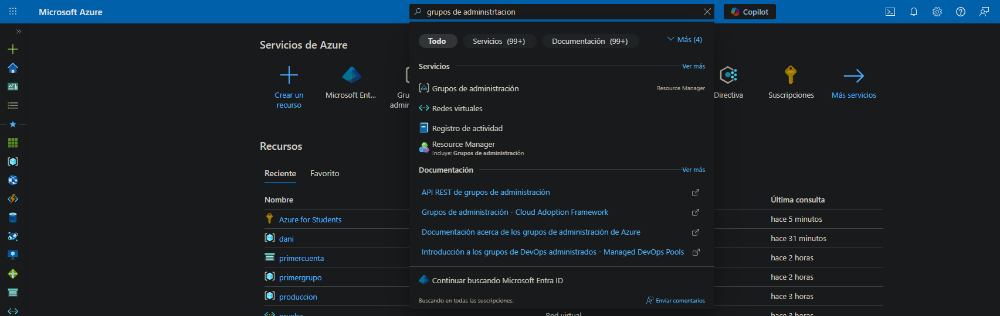  

Create a new Management Group with the following configuration:
- **Management Group ID:** `az104-mg1`
- **Display Name:** `az104-mg1`

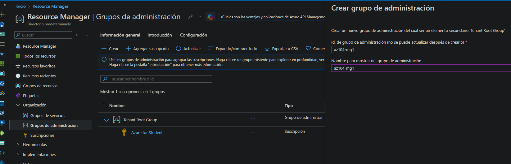

After creation, wait a few moments until the Management Group appears in the hierarchy.

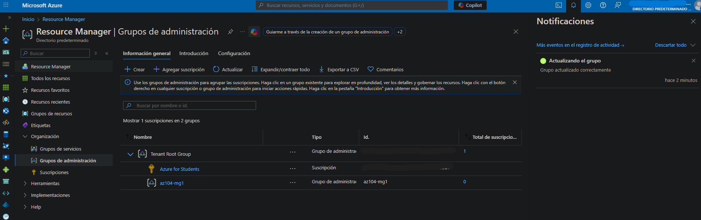

---

## Task 2 – Assign a built-in RBAC role

Inside the Management Group `az104-mg1`, navigate to **Access Control (IAM)** and select **Add → Add role assignment**.
  

Assign the **Virtual Machine Contributor** role to the Help Desk group.  
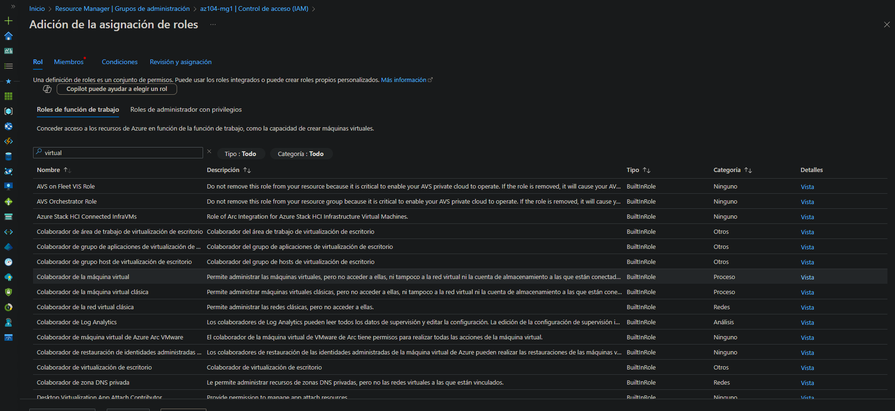  

This role allows management of virtual machines without granting access to the operating system or related networking and storage resources.
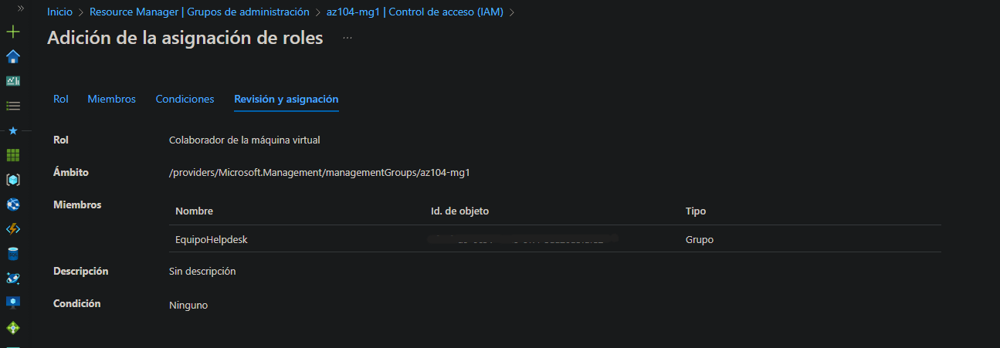  

Verify the assignment under **Access Control (IAM) → Role assignments**.

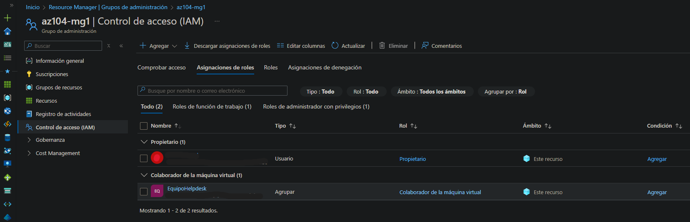

---

## Task 3 – Create a custom RBAC role

From **Access Control (IAM)**, select **Add → Custom role**.

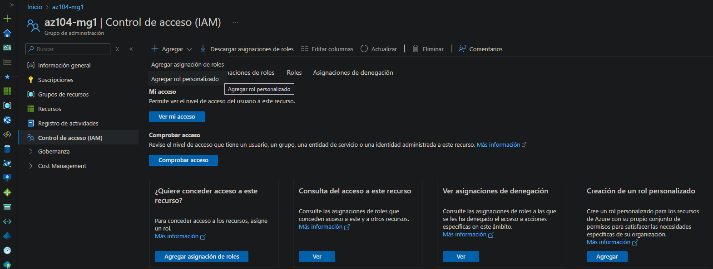 

Configure the role:
- **Role name:** `Custom Support Request`
- **Description:** A custom contributor role for support requests
- **Baseline permissions:** Clone role
- **Cloned role:** Support Request Contributor
  
 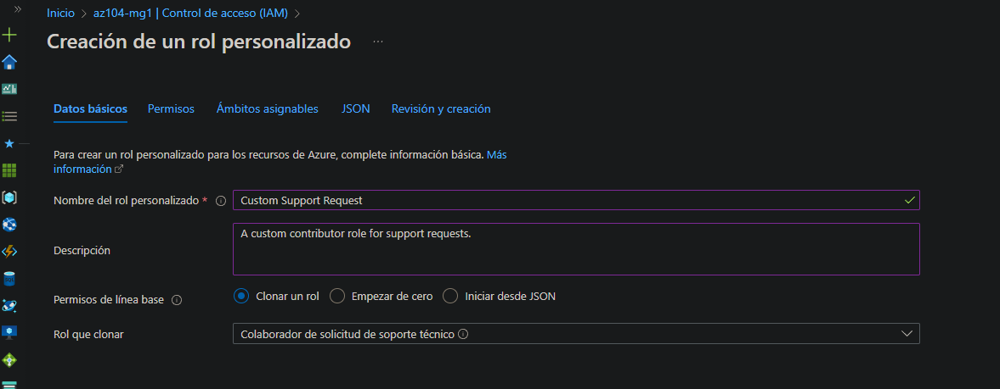  

Exclude the permission:
- **Other: Register Support Resource Provider**
  
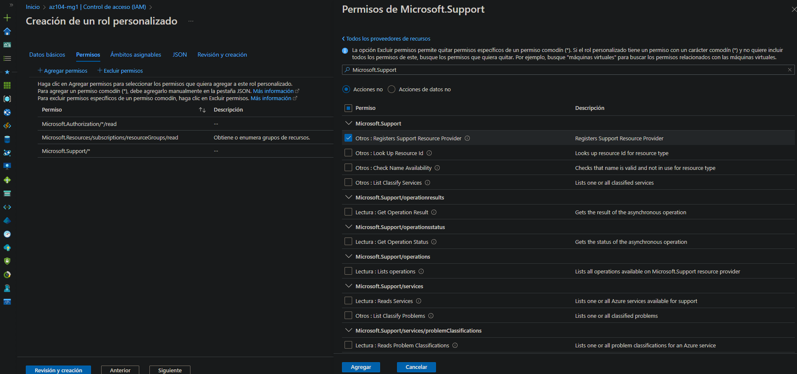

This permission is added as a **NotAction**, preventing the Help Desk team from registering new Azure resource providers.

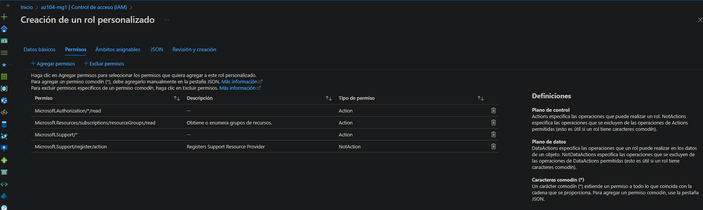 

Confirm that the assignable scope is set to the Management Group `az104-mg1` and review the generated JSON before creating the role.

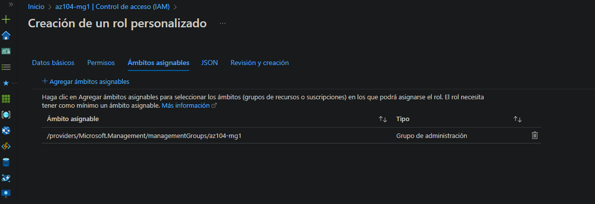 
 
 


 
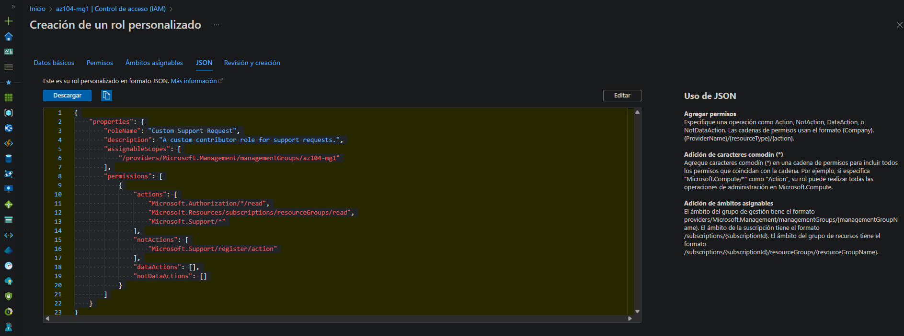  
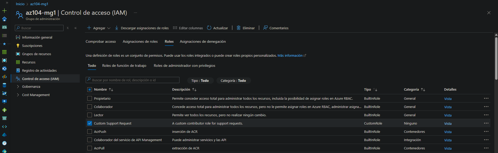

---

## Task 4 – Review role changes using Activity Log

Navigate to the **Activity Log** of the Management Group `az104-mg1`.

Review:
- Role assignments
- Creation of the custom RBAC role
- Administrative changes performed during the lab

**Screenshots:**  
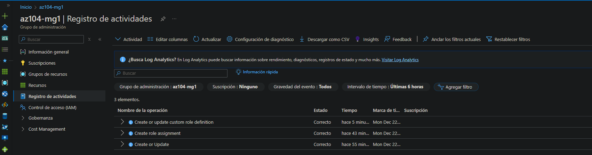  
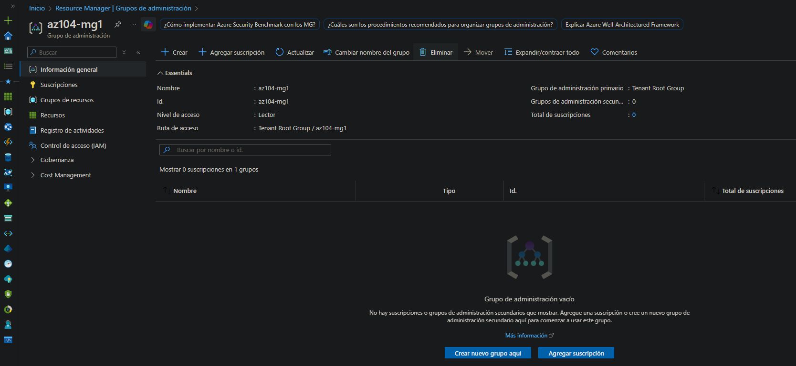  
  
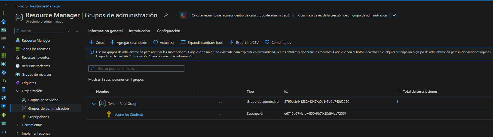

---

## Cleanup

To avoid unnecessary costs and configuration leftovers, delete the Management Group once the lab is completed.

### Azure Portal
Management Group → Overview → Delete

### Azure PowerShell
```powershell
Remove-AzManagementGroup -GroupName az104-mg1
