# Lab 02b – Manage Governance with Azure Policy (AZ-104)

## Summary
In this lab, I focused on implementing governance in Azure using **Azure Policy**, **resource tagging**, and **resource locks**.  
The goal was to enforce organizational standards, improve cost tracking, and protect critical resources from accidental modification or deletion.

---

## Business Scenario (Roleplay)

In my scenario, the organization has significantly expanded its Azure footprint over the past year.  
During a recent internal audit, multiple resources were found without key information such as owner, project, or cost center.

To improve governance and operational control, the organization decided to:
- Standardize the use of resource tags
- Enforce tagging through Azure Policy
- Automatically remediate non-compliant resources
- Protect critical resources using locks

These actions align with the **Microsoft Well-Architected Framework** and the **Cloud Adoption Framework**.

---

## Lab Objectives

- Create and apply tags to resource groups
- Enforce tagging using Azure Policy
- Automatically inherit tags from the resource group
- Remediate compliance issues using policy remediation
- Configure and validate resource locks
- Clean up resources after completion

---

## Task 1 – Create the resource group and assign tags

First, I created the resource group where the entire lab would be executed.

- **Resource group name:** `az104-rg2`
- **Region:** East US

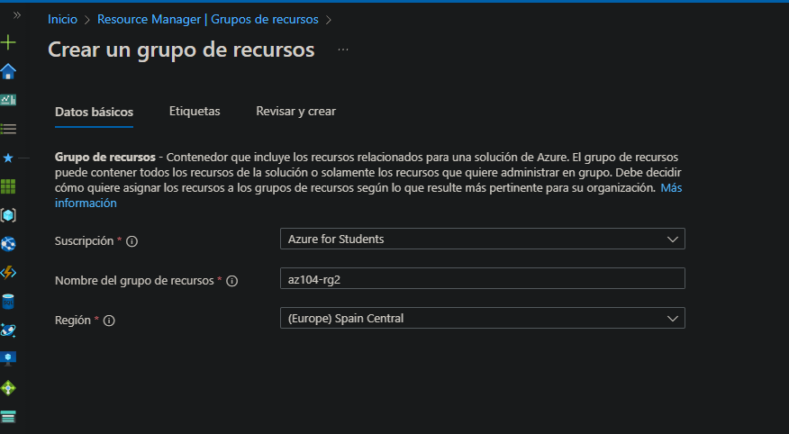

After the resource group was created, I navigated to the **Tags** section and added the following tag:

- **Name:** Cost Center  
- **Value:** 000  

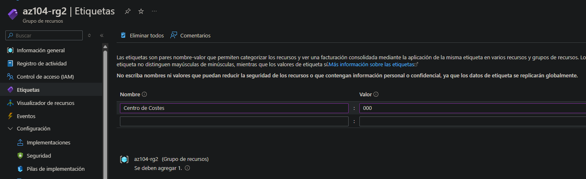

---

## Task 2 – Enforce tagging using Azure Policy

From the Azure portal, I navigated to **Policy**, and under **Definitions**, searched for the built-in policy:

**Require a tag and its value on resources**

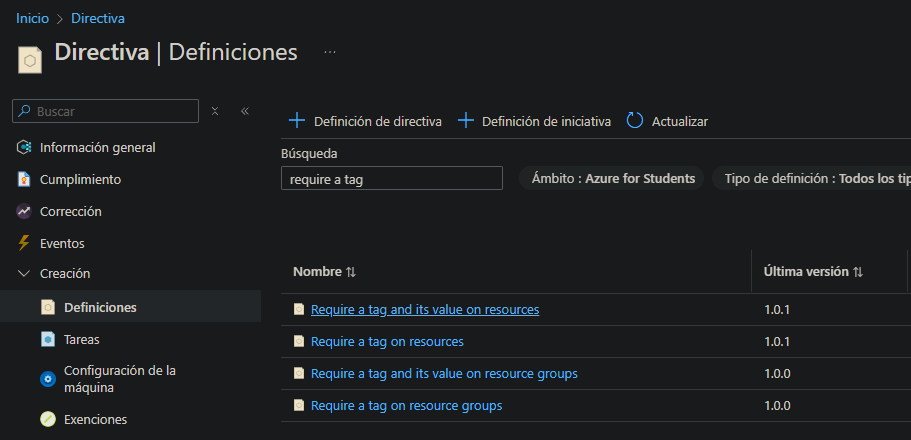

I assigned the policy and configured the **scope** to target the `az104-rg2` resource group.

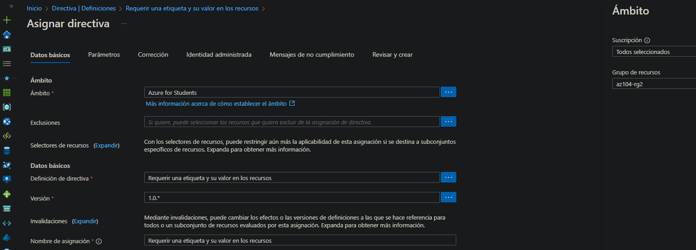

Next, I configured the policy assignment identification details and ensured policy enforcement was enabled.

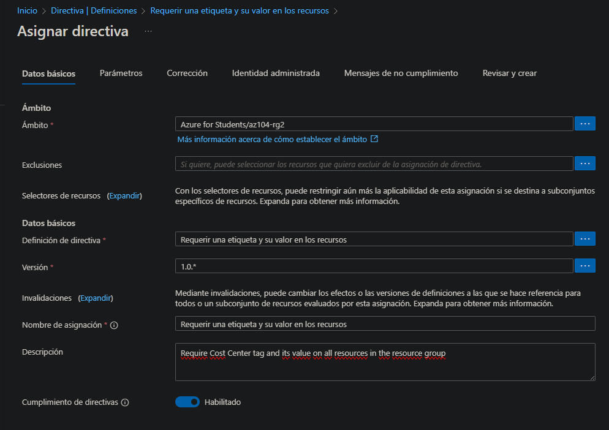

Before creating the assignment, I reviewed the configuration to confirm it was correct.

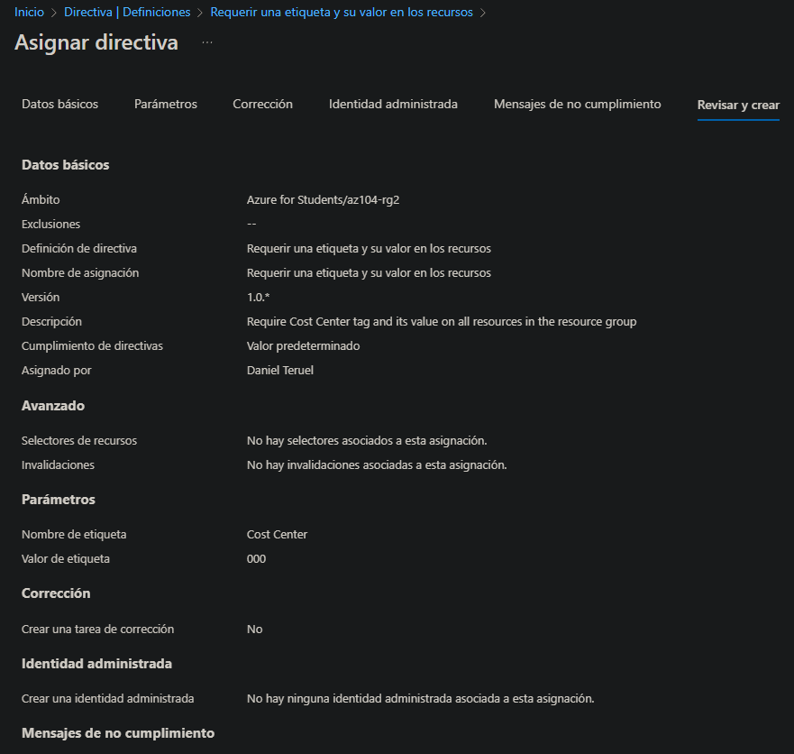

Once the policy was created, I navigated to **Compliance** to verify that the policy was active and correctly applied.

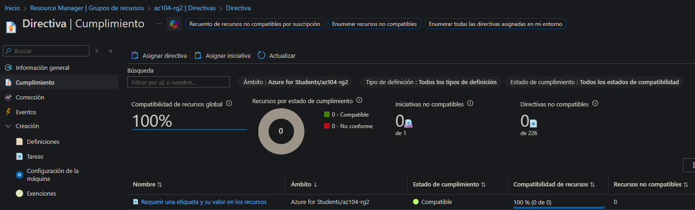

To validate enforcement, I attempted to create a **Storage Account** inside the resource group.

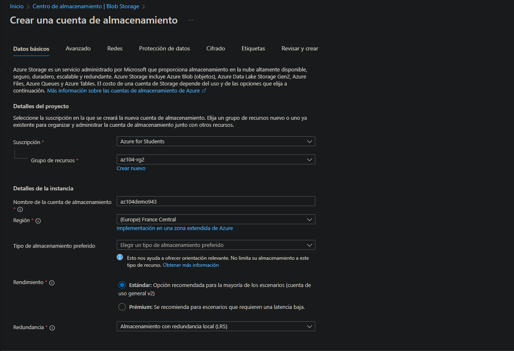

The deployment failed because the required tag was missing, confirming that the policy was working as expected.

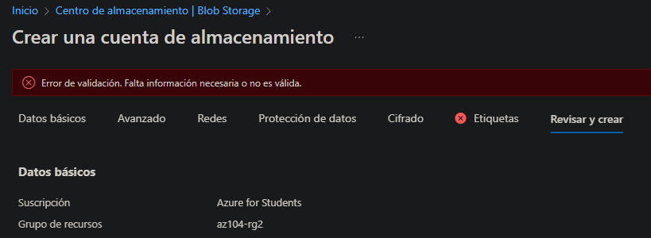  
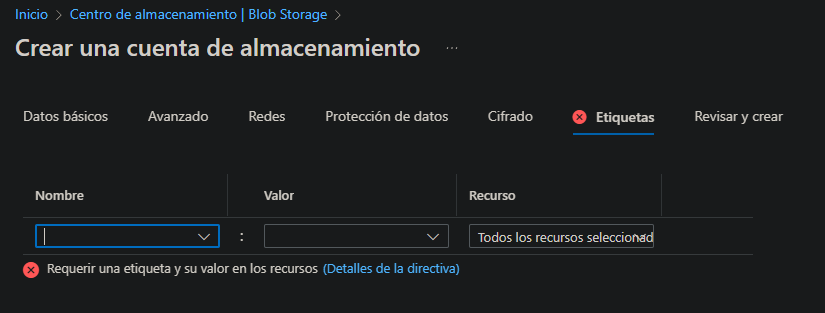

I then proceeded to **delete the policy assignment**.

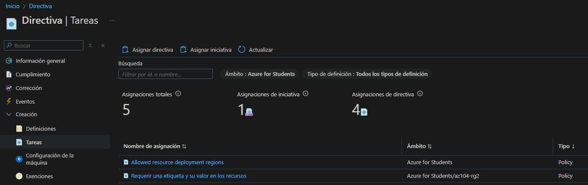  
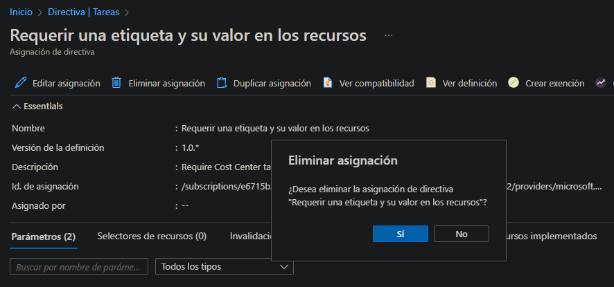

After removing the policy, I retried creating the storage account and was able to deploy it successfully, as the restriction was no longer in place.

---

## Task 3 – Inherit tags automatically from the resource group

Next, I went back to **Policy → Assignments → Assign policy** and selected the definition:

**Inherit a tag from the resource group if missing**

I configured the scope to the `az104-rg2` resource group, provided a name and description, and enabled enforcement.

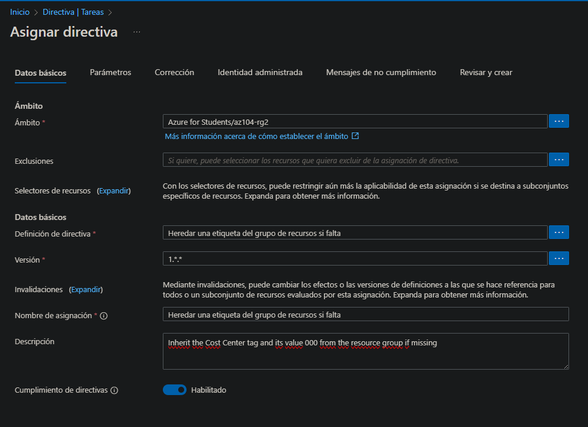

In the **Remediation** section, I enabled **Create a remediation task** and selected the corresponding policy.  
I also configured the tag name parameter correctly.

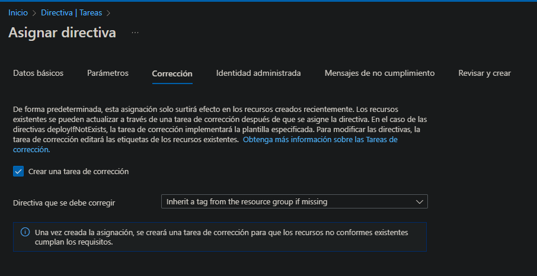

Before creating the assignment, I reviewed the configuration.

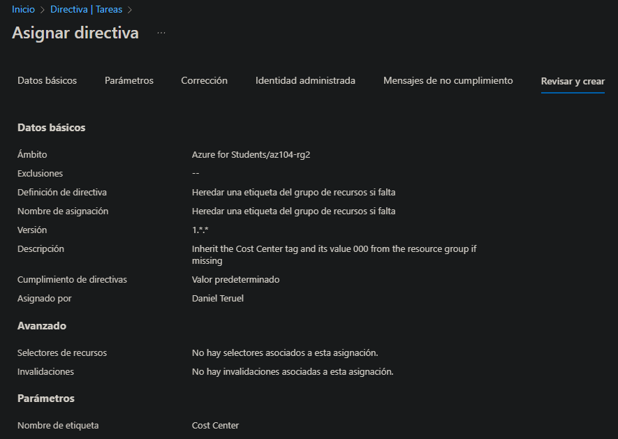

Next, I created a new storage account within the resource group.

At this point, I identified an issue:  
The resource group tag was defined as **“Centro de costes”**, while the policy assignment used **“Cost Center”**.  
Due to this mismatch, the policy did not apply correctly.

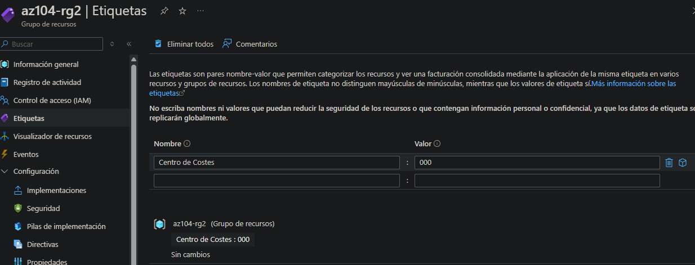

To fix the issue, I added the **Cost Center** tag to the resource group so it matched the policy assignment exactly.

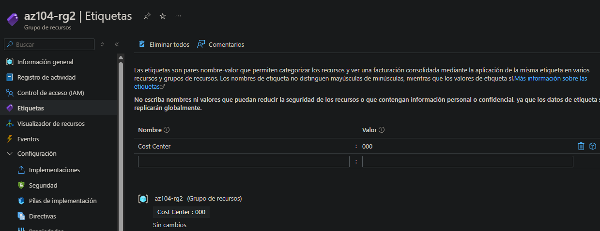

After repeating the process with the corrected configuration, the policy successfully inherited the tag and applied it automatically to the resource.

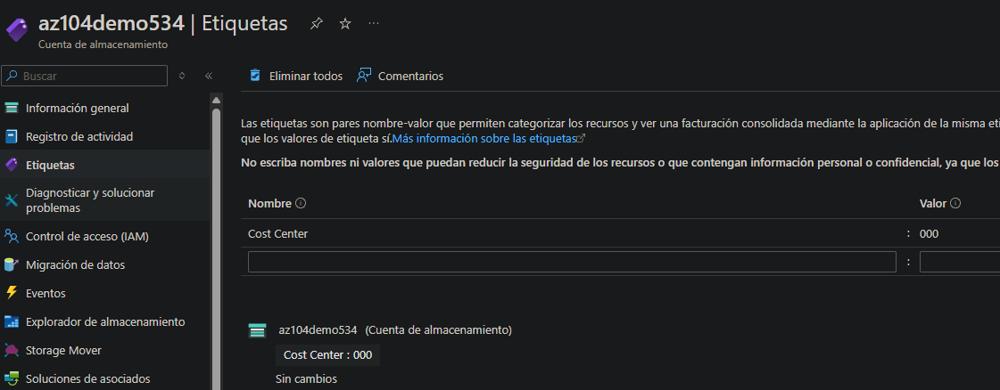

---

## Task 4 – Configure and test resource locks

Finally, I navigated to the resource group and opened **Settings → Locks**.  
I created a lock with the following configuration:

- **Name:** rg-lock  
- **Lock type:** Delete  

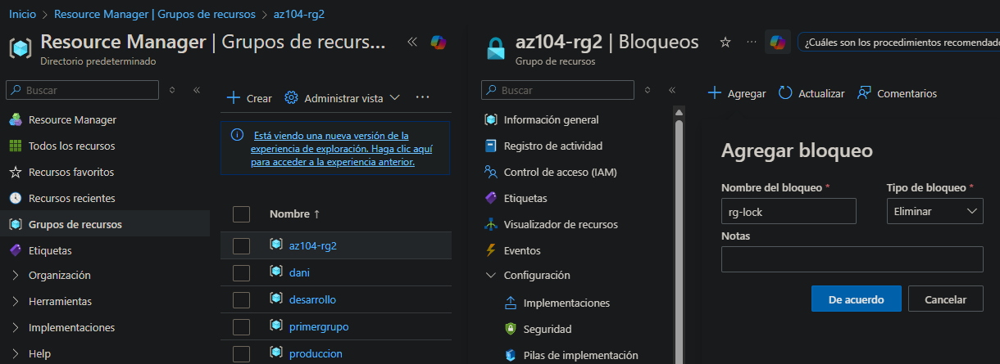

I then attempted to delete the storage account inside the resource group.

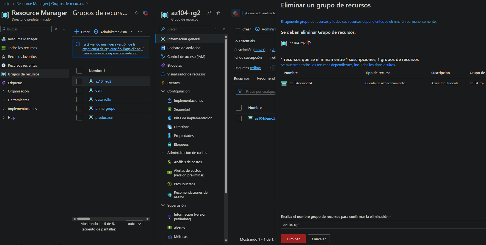

The deletion was blocked successfully, confirming that the lock was applied correctly and the resource was protected.

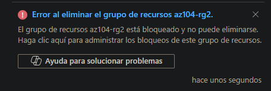

---

## Cleanup

To avoid unnecessary costs and keep the environment clean, I deleted all resources created during the lab.  
I first removed the lock and then deleted the resource group, ensuring that no resources or charges remained.

---
