# Lab 05 – Implementar Conectividad entre Redes en Azure (AZ-104)

## Resumen
En este laboratorio trabajé con **conectividad entre redes virtuales en Azure** para permitir la comunicación entre recursos ubicados en diferentes VNets. Durante la práctica:

- Creé dos máquinas virtuales en dos redes virtuales diferentes.
- Verifiqué la conectividad inicial usando **Network Watcher**.
- Configuré **emparejamiento de redes virtuales (VNet Peering)**.
- Volví a comprobar la conectividad usando **PowerShell**.
- Creé una **ruta personalizada (UDR)** para controlar el enrutamiento del tráfico.
- Asocié la tabla de rutas a una subred específica.

Este laboratorio me permitió entender cómo se interconectan redes en Azure y cómo se puede controlar el flujo de tráfico entre subredes y VNets.

## Escenario de Negocio
La organización separa los servicios centrales (Core Services) del resto de departamentos, como el área de fabricación. Sin embargo, en algunos escenarios es necesario que ambos entornos puedan comunicarse. Para ello, se debe configurar conectividad segura entre redes virtuales separadas y controlar el enrutamiento del tráfico.

## Objetivos del Laboratorio

- Crear dos máquinas virtuales en redes virtuales diferentes.
- Verificar la conectividad entre VNets usando Network Watcher.
- Configurar emparejamiento entre redes virtuales (VNet Peering).
- Verificar la conectividad usando PowerShell.
- Crear una tabla de rutas personalizada (UDR).
- Asociar la ruta a una subred específica.
- Aplicar buenas prácticas de limpieza de recursos.

---

## Tarea 1 – Crear CoreServicesVM y su red virtual

Como siempre, comencé creando el **grupo de recursos** donde se alojarán todos los recursos del laboratorio.

A continuación, fui a **Máquinas virtuales** y creé una nueva VM con la siguiente configuración:

Configuración | Valor
--- | ---
Grupo de recursos | az104-rg5
Nombre de la máquina virtual | CoreServicesVM
Región | France Central
Opciones de disponibilidad | No se requiere redundancia de infraestructura
Tipo de seguridad | Estándar
Imagen | Windows Server 2025 Datacenter - x64 Gen2
Tamaño | Standard_DS2_v3
Usuario | localadmin
Contraseña | ********
Puertos de entrada públicos | Ninguno

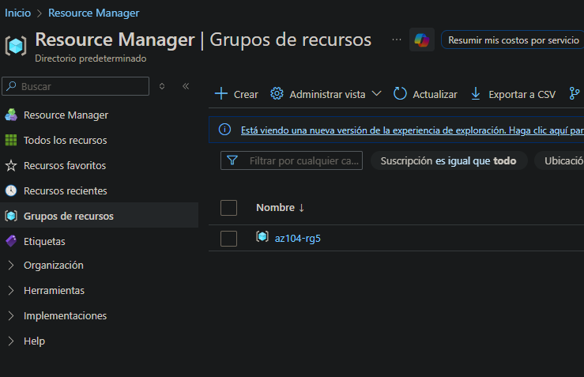

Durante la creación, creé también la red virtual donde se conectará esta VM.

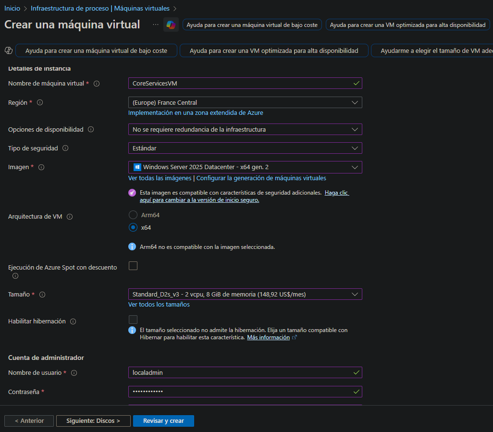

Configuré la red virtual con los siguientes parámetros:

Configuración | Valor
--- | ---
Nombre | CoreServicesVnet
Espacio de direcciones | 10.0.0.0/16
Subred | Core
Rango de subred | 10.0.0.0/24

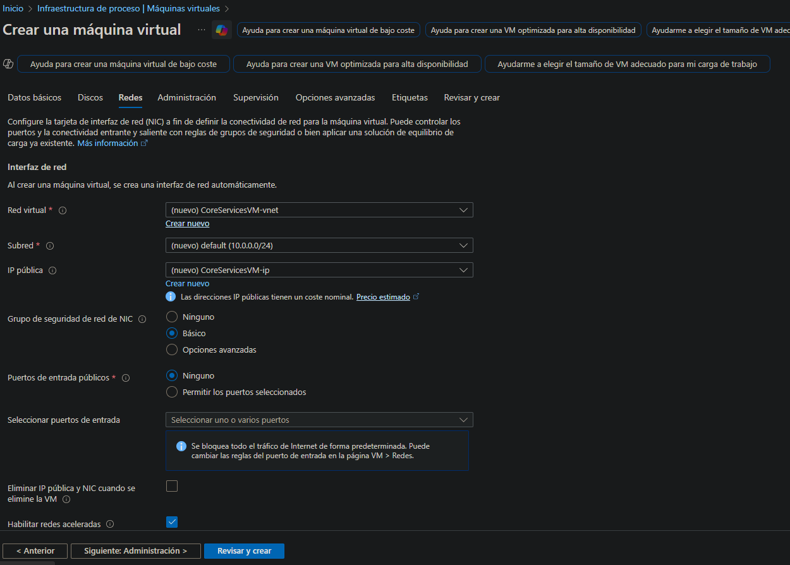

Después, deshabilité el **diagnóstico de arranque**.

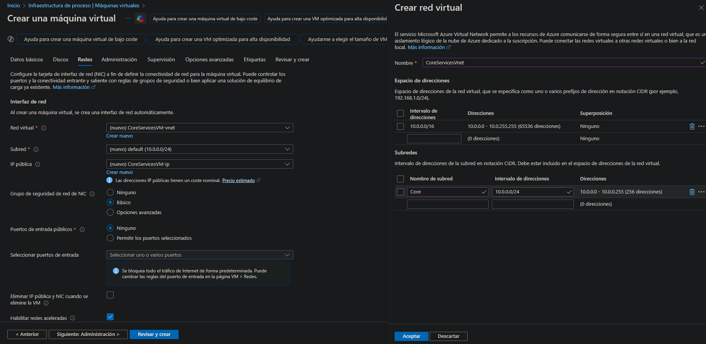

Finalmente, revisé la configuración y creé la máquina virtual.

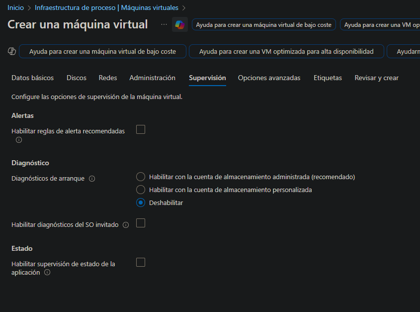

---

## Tarea 2 – Crear ManufacturingVM en otra red virtual

A continuación, creé una segunda máquina virtual en otra red virtual distinta con la siguiente configuración:

Configuración | Valor
--- | ---
Grupo de recursos | az104-rg5
Nombre de la máquina virtual | ManufacturingVM
Región | France Central
Tipo de seguridad | Estándar
Opciones de disponibilidad | No se requiere redundancia de infraestructura
Imagen | Windows Server 2025 Datacenter - x64 Gen2
Tamaño | Standard_DS2_v3
Usuario | localadmin
Contraseña | ********
Puertos de entrada públicos | Ninguno

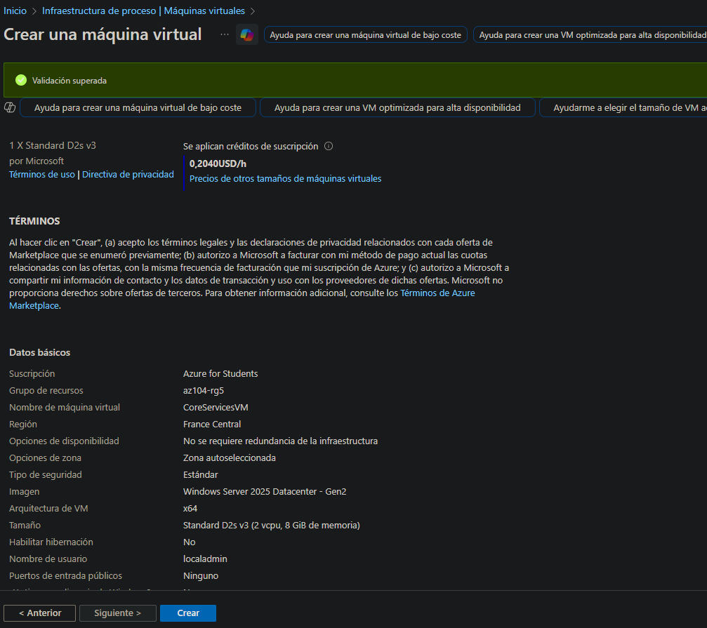

Durante la creación, configuré una nueva red virtual con estos parámetros:

Configuración | Valor
--- | ---
Nombre | ManufacturingVnet
Espacio de direcciones | 172.16.0.0/16
Subred | Manufacturing
Rango de subred | 172.16.0.0/24

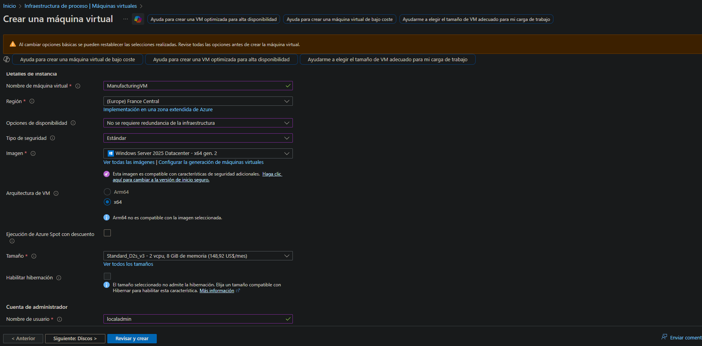

---

## Tarea 3 – Probar conectividad con Network Watcher

Una vez creadas ambas máquinas virtuales, fui a **Network Watcher → Solucionar problemas de conexión** y configuré una prueba:

- Origen: CoreServicesVM  
- Destino: ManufacturingVM  
- Protocolo: TCP  
- Puerto: 3389  

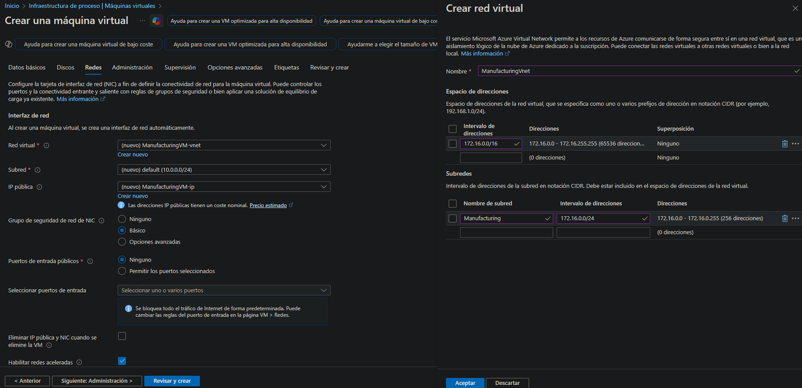

Al ejecutar el diagnóstico, la prueba de conectividad resultó **Inaccesible**, ya que las VNets aún no estaban emparejadas.

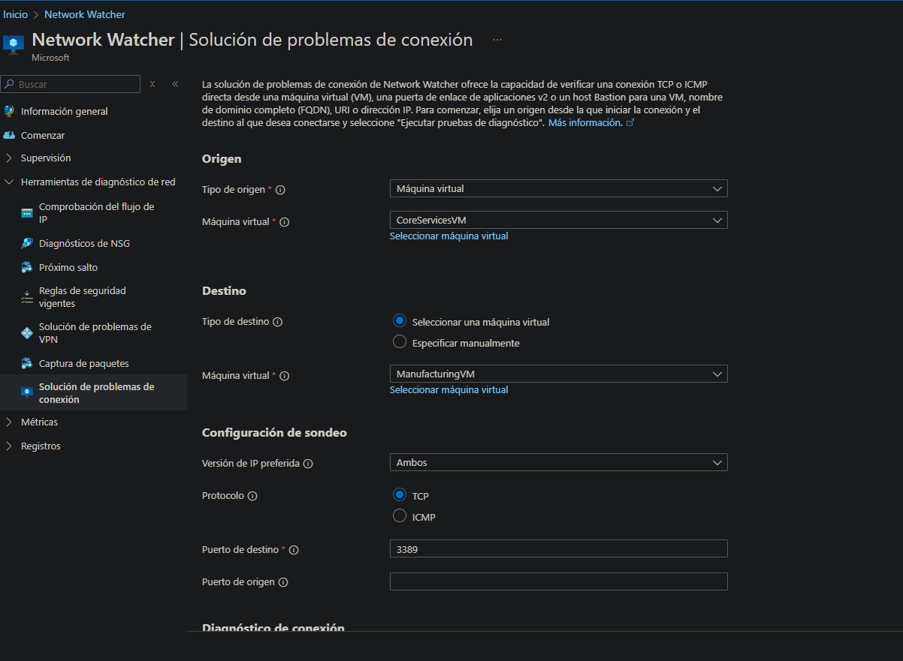

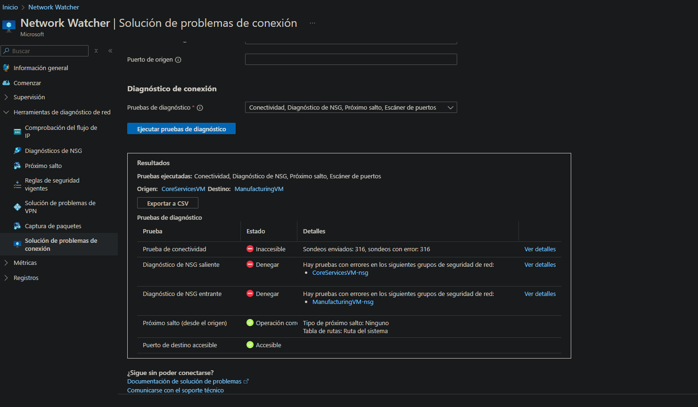

---

## Tarea 4 – Configurar el emparejamiento entre VNets

Fui a **Redes virtuales → CoreServicesVnet → Emparejamientos** y agregué un nuevo emparejamiento.

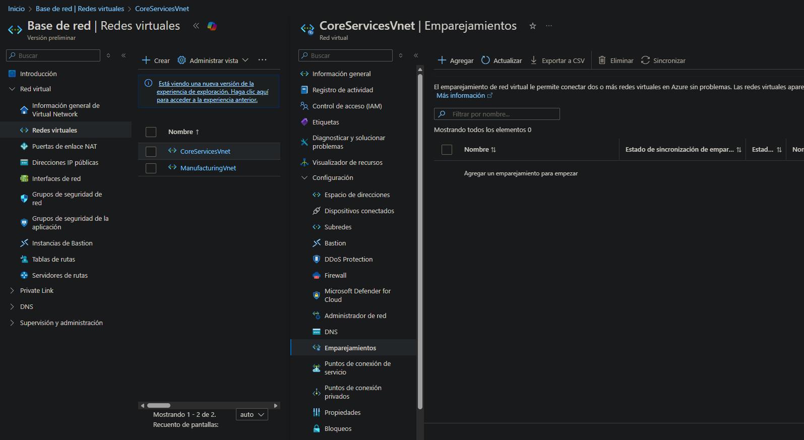

Configuré el emparejamiento entre **CoreServicesVnet** y **ManufacturingVnet**, permitiendo:

- Acceso entre ambas VNets
- Tráfico reenviado (tráfico que no se origina en esta VNet)

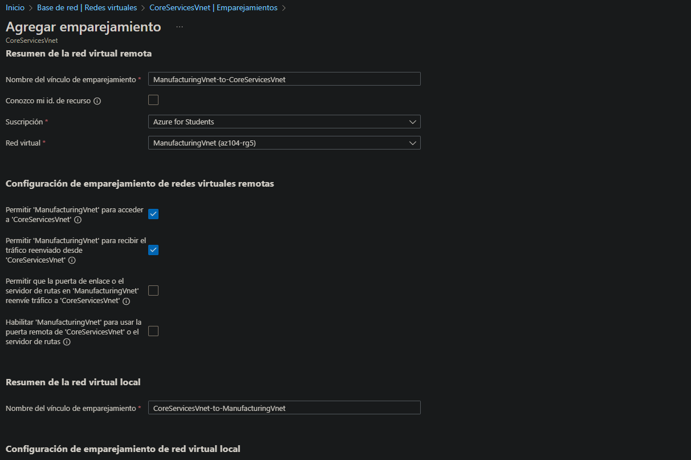

Apliqué la configuración tanto de CoreServices hacia Manufacturing como de Manufacturing hacia CoreServices.

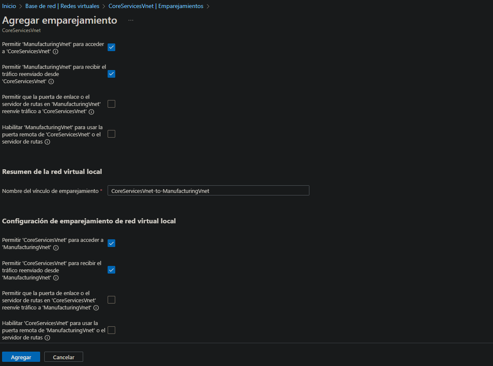

Una vez creado, verifiqué que en ambas VNets el estado del emparejamiento aparecía como **Conectado**.

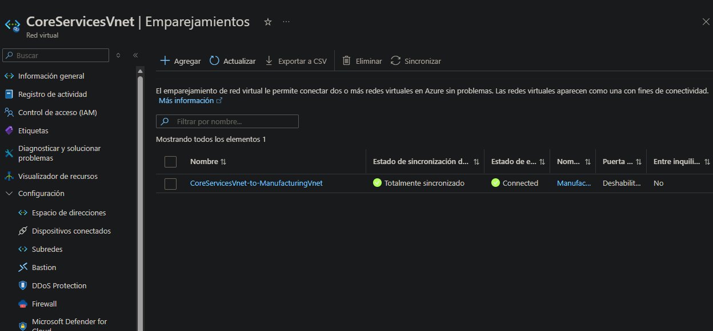

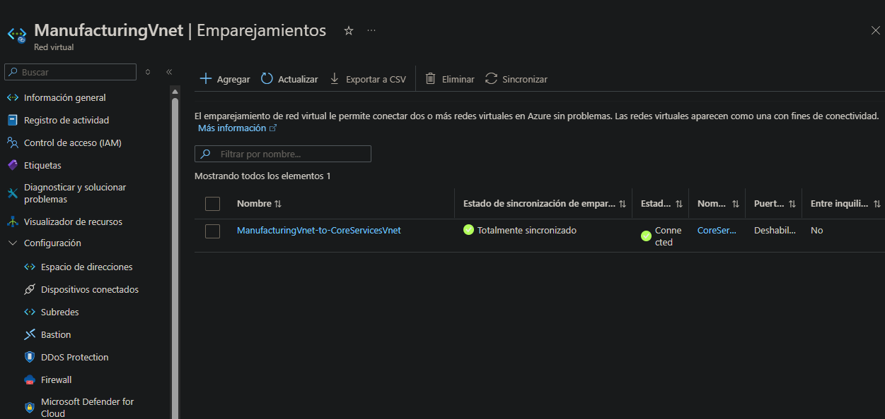

---

## Tarea 5 – Probar conectividad usando PowerShell

Ahora probé la conectividad desde **ManufacturingVM** usando **Ejecutar comando → RunPowerShellScript**.

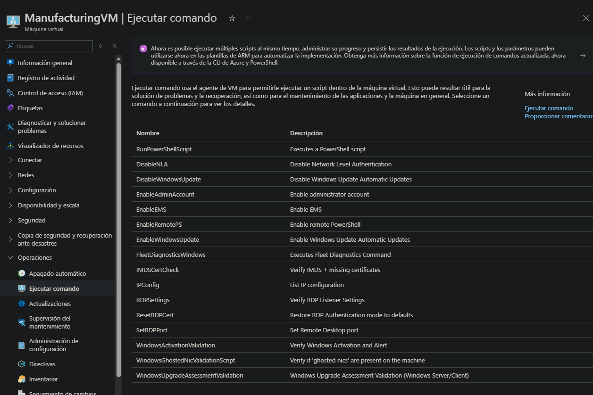

Ejecuté el siguiente comando:

```powershell
Test-NetConnection 10.0.0.4 -Port 3389
