# Lab 05 – Implement Connectivity Between Networks (AZ-104)

## Summary

In this lab, I worked with **connectivity between virtual networks in Azure** to allow communication between resources located in different VNets. During this practice:

- I created two virtual machines in two different virtual networks.
- I verified the initial connectivity using **Network Watcher**.
- I configured **Virtual Network Peering (VNet Peering)**.
- I verified connectivity again using **PowerShell**.
- I created a **custom route (UDR)** to control traffic routing.
- I associated the route table to a specific subnet.

This lab allowed me to understand how networks are interconnected in Azure and how traffic flow between subnets and VNets can be controlled.

## Business Scenario

The organization separates core services (Core Services) from other departments, such as the manufacturing area. However, in some scenarios it is necessary for both environments to communicate. To achieve this, secure connectivity between separate virtual networks must be configured and traffic routing must be controlled.

## Lab Objectives

- Create two virtual machines in different virtual networks.
- Verify connectivity between VNets using Network Watcher.
- Configure virtual network peering (VNet Peering).
- Verify connectivity using PowerShell.
- Create a custom route table (UDR).
- Associate the route to a specific subnet.
- Apply best practices for resource cleanup.

---

## Task 1 – Create CoreServicesVM and its Virtual Network

As usual, I started by creating the **resource group** where all the lab resources will be hosted.


Next, I went to **Virtual Machines** and created a new VM with the following configuration:

Configuration | Value
--- | ---
Resource group | az104-rg5
Virtual machine name | CoreServicesVM
Region | France Central
Availability options | No infrastructure redundancy required
Security type | Standard
Image | Windows Server 2025 Datacenter - x64 Gen2
Size | Standard_DS2_v3
Username | localadmin
Password | ********
Public inbound ports | None


During the creation, I also created the virtual network where this VM will be connected.


I configured the virtual network with the following parameters:

Configuration | Value
--- | ---
Name | CoreServicesVnet
Address space | 10.0.0.0/16
Subnet | Core
Subnet range | 10.0.0.0/24


After that, I disabled **boot diagnostics**.


Finally, I reviewed the configuration and created the virtual machine.


---

## Task 2 – Create ManufacturingVM in Another Virtual Network

Next, I created a second virtual machine in another different virtual network with the following configuration:

Configuration | Value
--- | ---
Resource group | az104-rg5
Virtual machine name | ManufacturingVM
Region | France Central
Security type | Standard
Availability options | No infrastructure redundancy required
Image | Windows Server 2025 Datacenter - x64 Gen2
Size | Standard_DS2_v3
Username | localadmin
Password | ********
Public inbound ports | None


During the creation, I configured a new virtual network with the following parameters:

Configuration | Value
--- | ---
Name | ManufacturingVnet
Address space | 172.16.0.0/16
Subnet | Manufacturing
Subnet range | 172.16.0.0/24


---

## Task 3 – Test Connectivity Using Network Watcher

Once both virtual machines were created, I went to **Network Watcher → Connection troubleshoot** and configured a test:

- Source: CoreServicesVM  
- Destination: ManufacturingVM  
- Protocol: TCP  
- Port: 3389  


When running the diagnostic, the connectivity test result was **Unreachable**, since the VNets were not yet peered.


---

## Task 4 – Configure VNet Peering

I went to **Virtual networks → CoreServicesVnet → Peerings** and added a new peering.


I configured the peering between **CoreServicesVnet** and **ManufacturingVnet**, allowing:

- Access between both VNets
- Forwarded traffic (traffic that did not originate in this VNet)


I applied the configuration both from CoreServices to Manufacturing and from Manufacturing to CoreServices.


Once created, I verified that in both VNets the peering status appeared as **Connected**.


---

## Task 5 – Test Connectivity Using PowerShell

Now I tested connectivity from **ManufacturingVM** using **Run Command → RunPowerShellScript**.


I ran the following command:

```powershell
Test-NetConnection 10.0.0.4 -Port 3389
````

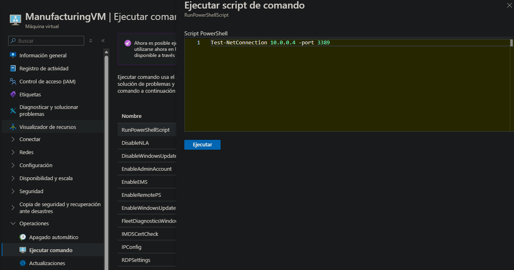

As you can see, the result is:

```
TcpTestSucceeded = True
```

Therefore, connectivity between both VNets is working correctly.

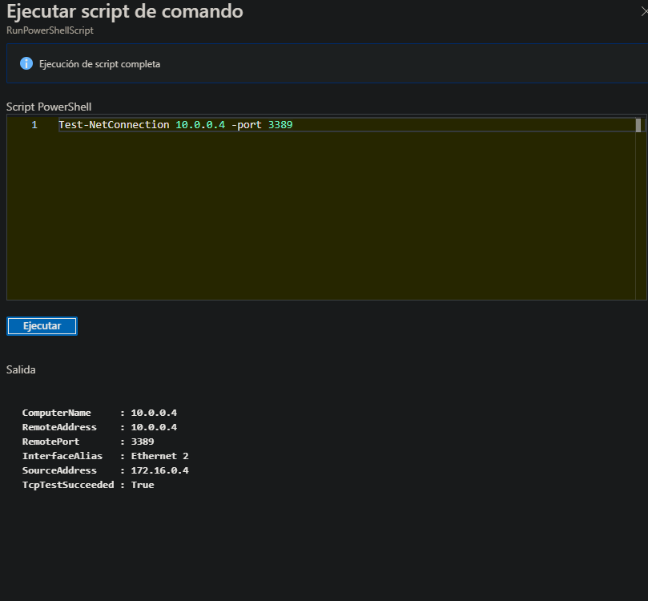

---

## Task 6 – Create a Custom Route (UDR)

Now I went to **CoreServicesVnet → Subnets** and added a new subnet:

| Configuration | Value       |
| ------------- | ----------- |
| Name          | perimeter   |
| Range         | 10.0.1.0/24 |

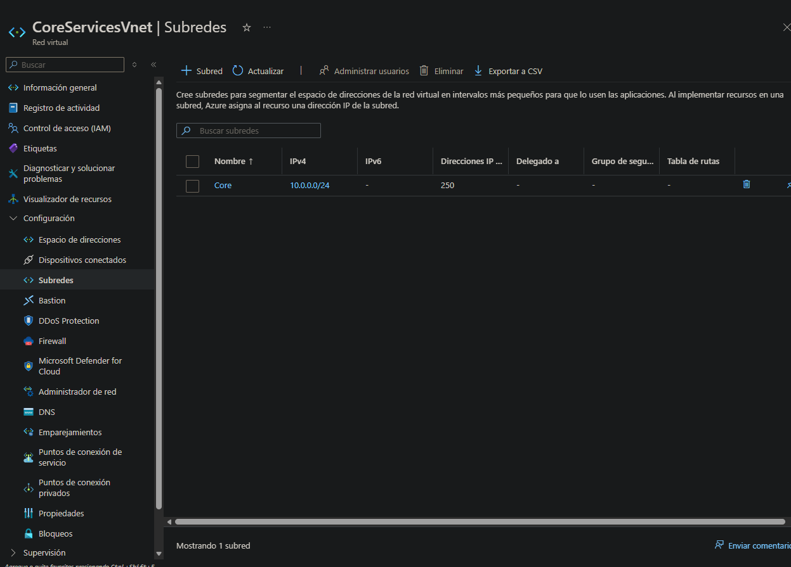

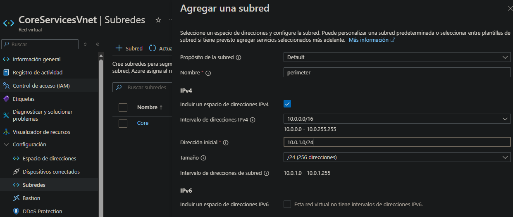

After that, I went to **Route tables** and created a new one.

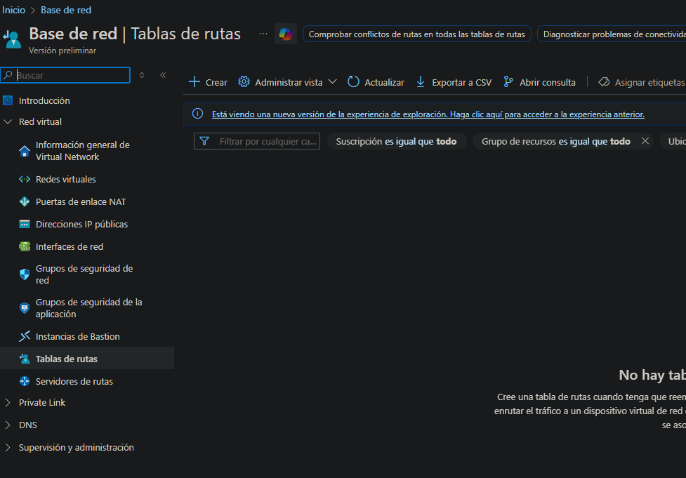

I created it with the corresponding name in the resource group.

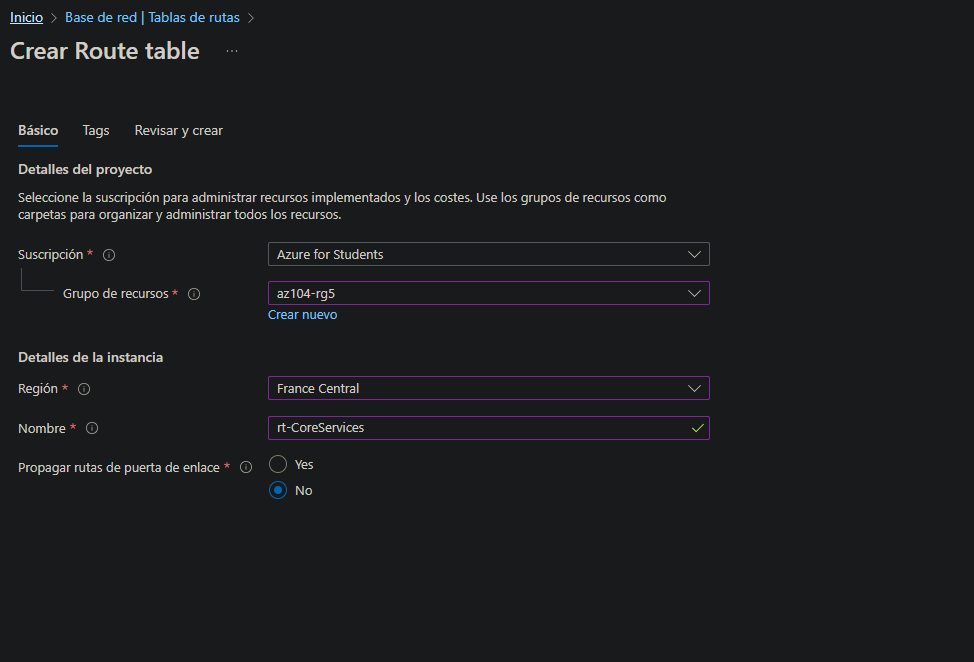

Once created, I entered it and added a new route.

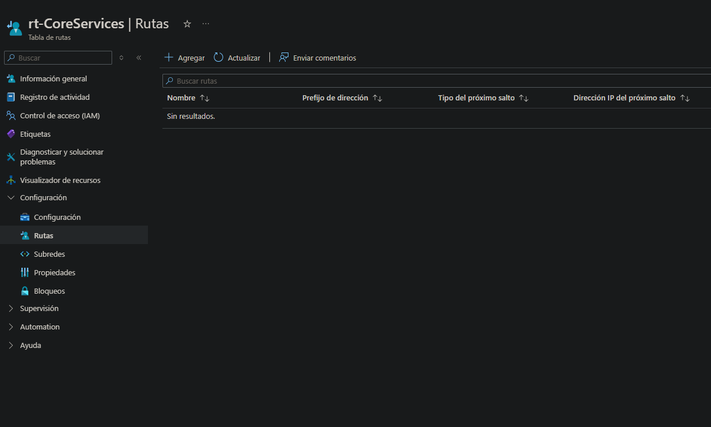

The route was configured as follows:

| Configuration       | Value             |
| ------------------- | ----------------- |
| Route name          | PerimetertoCore   |
| Destination         | IP addresses      |
| Destination address | 10.0.0.0/16       |
| Next hop            | Virtual appliance |
| Next hop address    | 10.0.1.7          |

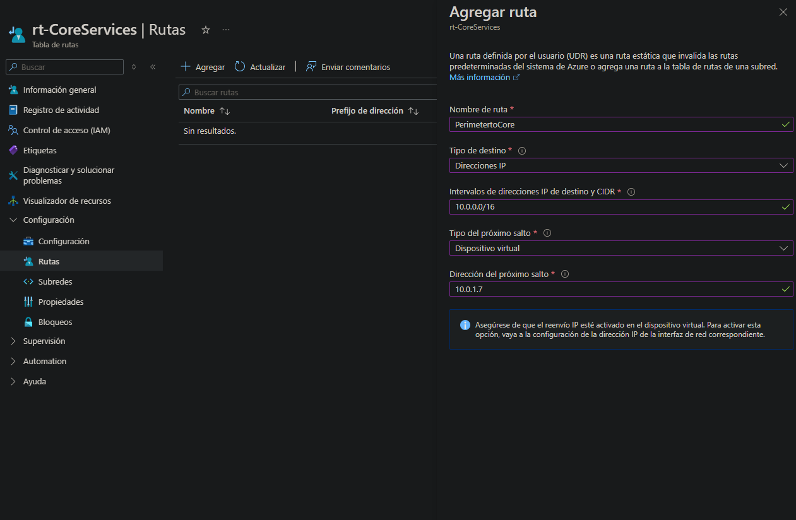

Then I went to **Settings → Subnets** and associated the route table to the subnet.

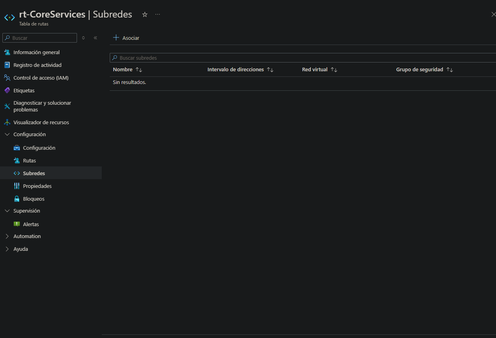

I selected the **CoreServicesVnet** network and the **Core** subnet.

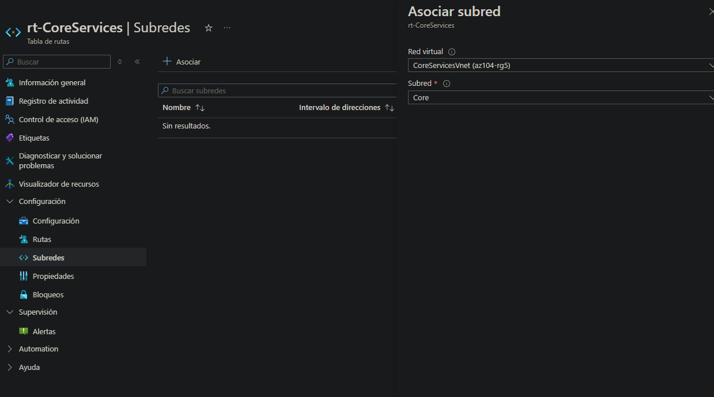

In this way, the Core subnet is now associated with the custom route.

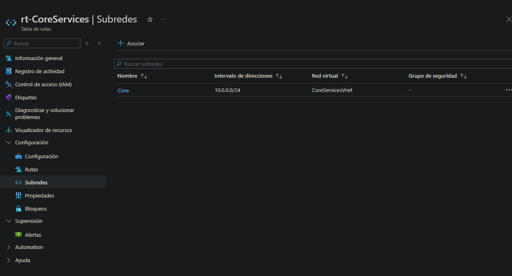

---

## Resource Cleanup

To avoid unnecessary costs, I deleted the resource group, which removes all the resources associated with the lab.

From the Azure portal:

```
Resource group → Delete resource group
```

Or using PowerShell:

```powershell
Remove-AzResourceGroup -Name az104-rg5
```

```
