# Lab 07 – Manage Azure Storage (AZ-104)

## Overview
In this lab, I worked with **Azure Storage** to create and configure storage accounts, secure blob and file storage, manage lifecycle rules, and control access using network restrictions and authentication mechanisms such as SAS tokens.

The goal was to understand how Azure Storage can be optimized for cost, secured at multiple layers, and integrated with Azure networking features.

---

## Business Scenario (Roleplay)

In this scenario, the organization currently stores data on local file servers.  
Most of this data is accessed infrequently, and storage costs need to be optimized.

Additionally, the organization wants to:
- Secure access to storage using network restrictions
- Control access using authentication and authorization mechanisms
- Protect data using immutable storage policies
- Evaluate Azure Files as a replacement for on-premises file shares

---

## Lab Objectives

- Create and configure an Azure Storage Account
- Secure storage using network access controls
- Configure lifecycle management rules
- Create and secure blob containers
- Use SAS tokens for controlled access
- Create and configure Azure File shares
- Restrict access using virtual networks
- Clean up resources after the lab

---

## Task 1 – Create and configure an Azure Storage Account

To start the lab, I created a new **Resource Group** to contain all resources used in this exercise.  
I named the resource group `az104-RG7`.

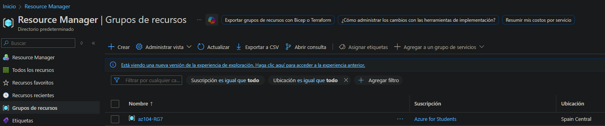

Inside this resource group, I created a new **Storage Account** with the required configuration.

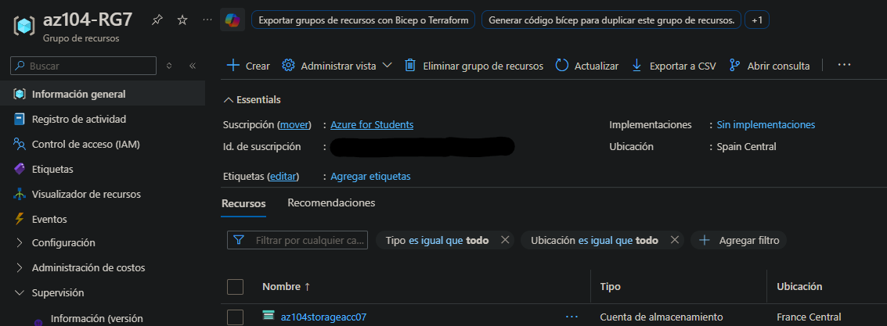

After the storage account was created, I navigated to **Security + networking → Networking → Manage public access**.

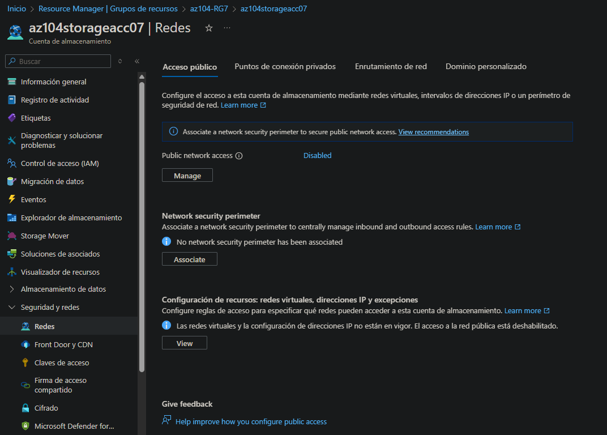

Here, I enabled **Public network access** but restricted it to **selected networks only**, allowing access exclusively from my public IP address.

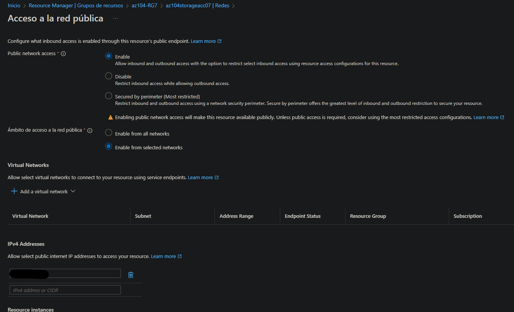

Next, I navigated to **Data management → Lifecycle management**.

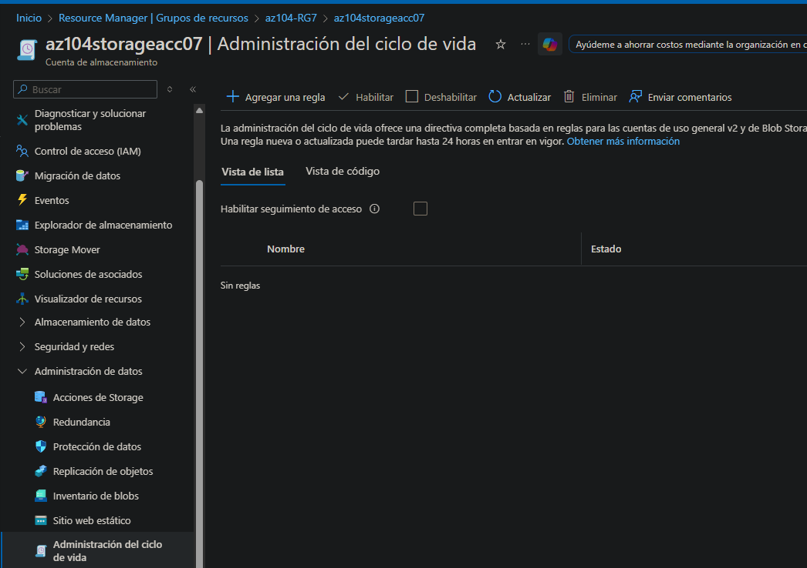

I added a new lifecycle rule named **movetocool**, applying it to all blobs in the storage account.

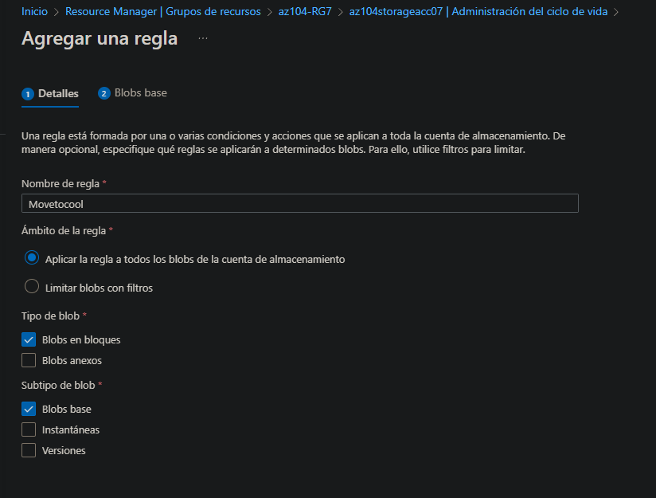

I configured the rule so that any blob **not modified for more than 30 days** would be moved from the **Hot** tier to the **Cool** tier, helping reduce storage costs.

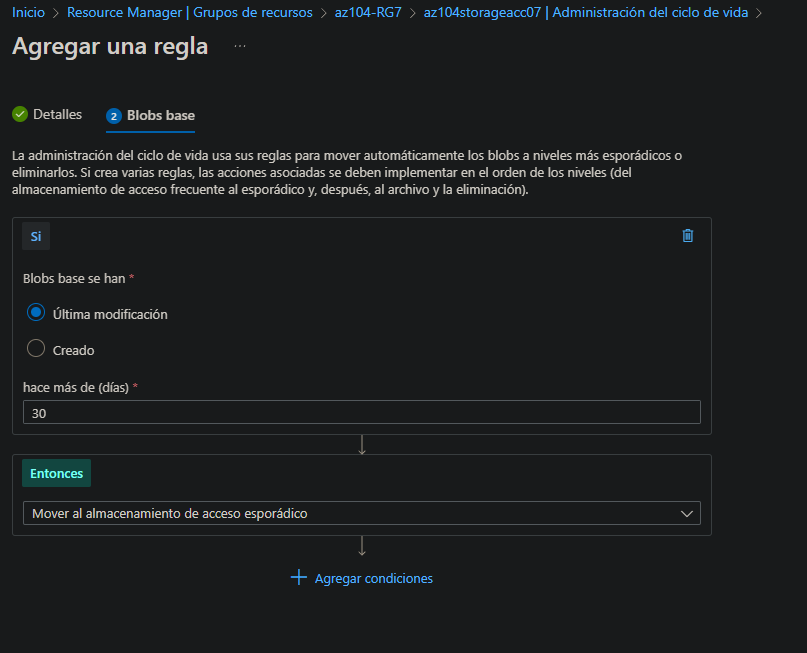

---

## Task 2 – Create and configure secure Blob storage

I returned to the storage account and created a new **Blob Container** named `data`, ensuring that the **public access level** was set to **Private**.

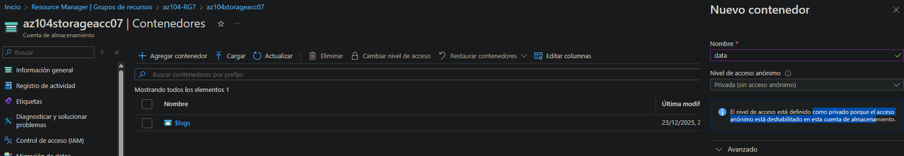

After creating the container, I navigated to **Settings → Access policy** and configured **Immutable Blob Storage** to retain blobs for **180 days**.

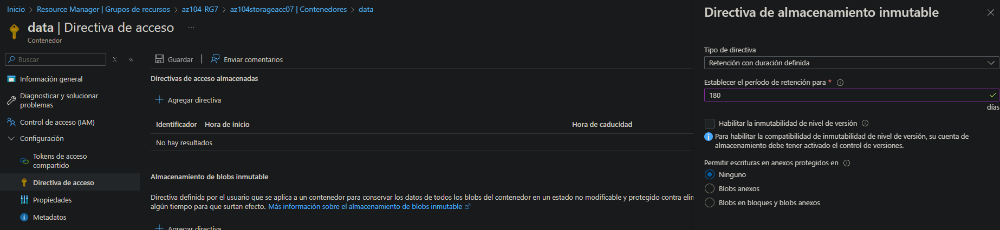

Next, I uploaded a PNG file to the container inside a new folder named `securitytest`, using the **Hot** access tier.  
During the upload, I could see that the immutable policy was already applied.

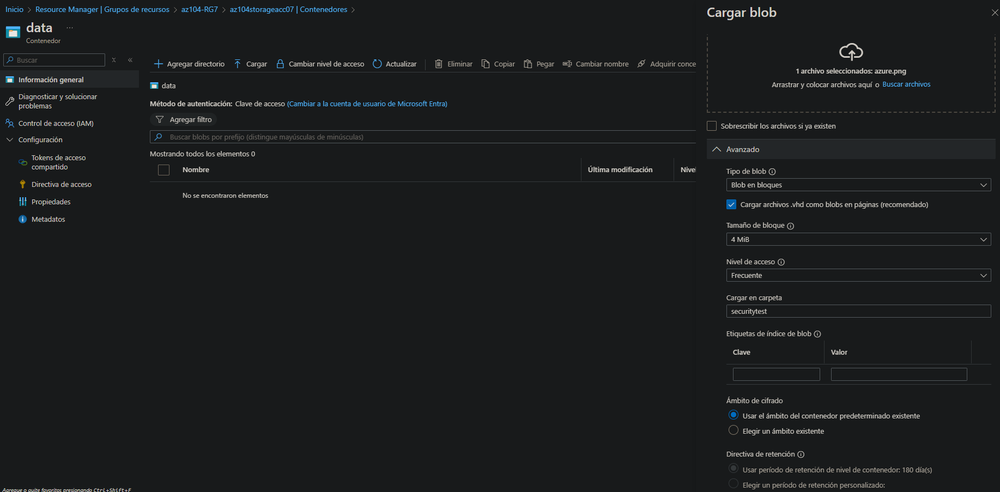

Once uploaded, I attempted to access the file directly but received a message indicating that **public access was not permitted**.

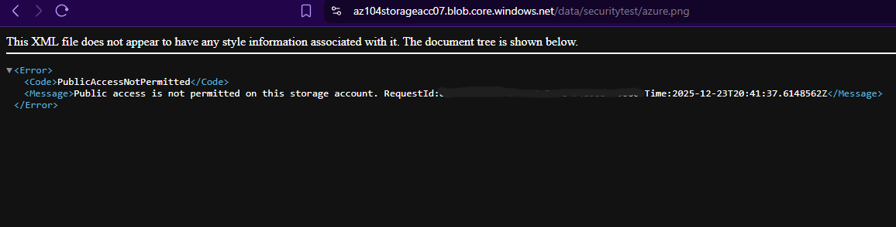

This occurred because the container is private and requires explicit authorization.  
To grant limited access, I generated a **SAS token** for the uploaded file, selecting the required permissions and copying the generated SAS URL.

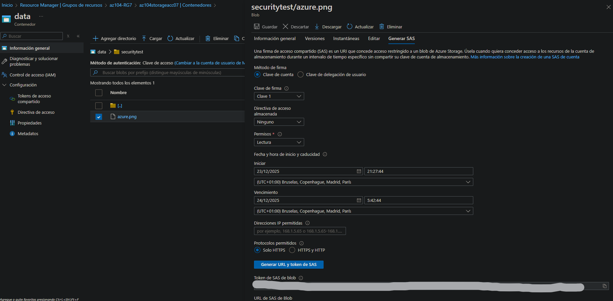

By opening the SAS URL in the browser, I was able to access the file successfully, confirming that access was granted through both network rules and SAS permissions.

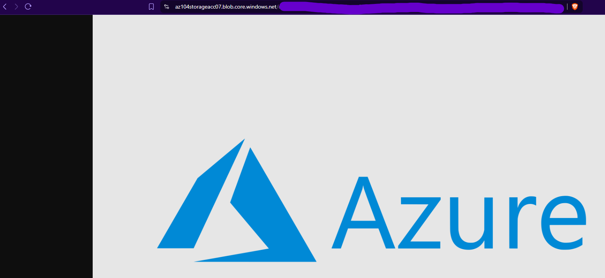

---

## Task 3 – Create and configure Azure File storage

Next, I navigated to **File shares** in the storage account.

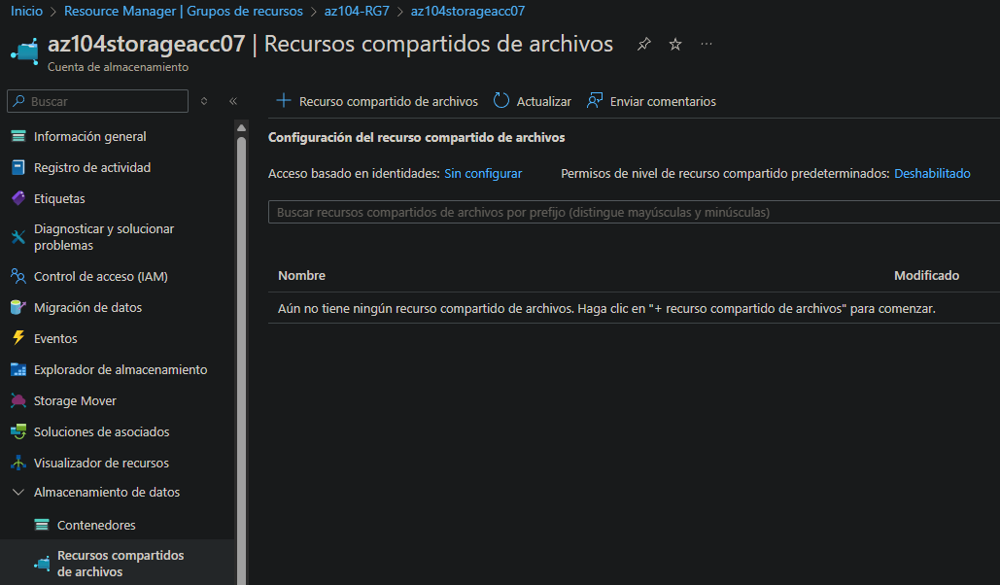

I created a new file share named `share1`, keeping the default **Transaction optimized** access tier.

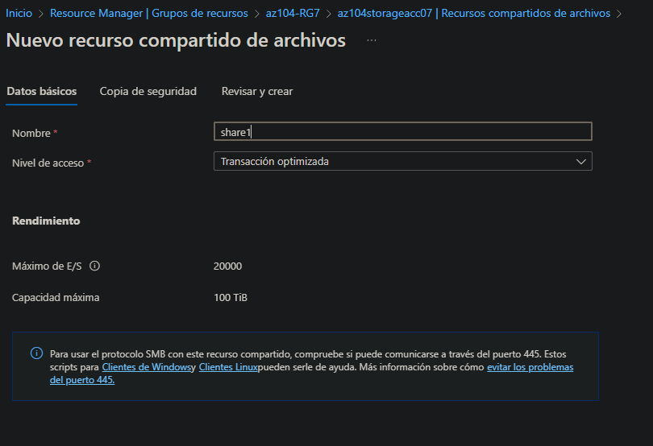

I disabled backups for this file share, as they were not required for this lab.

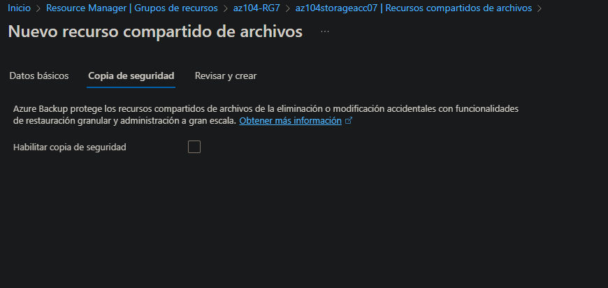

After creation, I verified that the file share was created successfully.

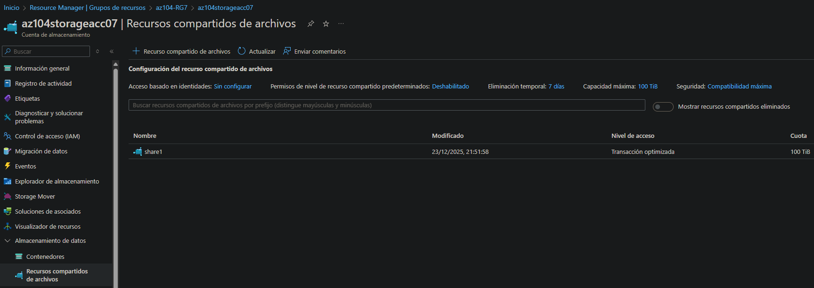

I then opened **Storage Browser**, selected the `share1` file share, and uploaded the same PNG file into it.

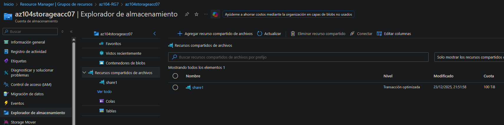  
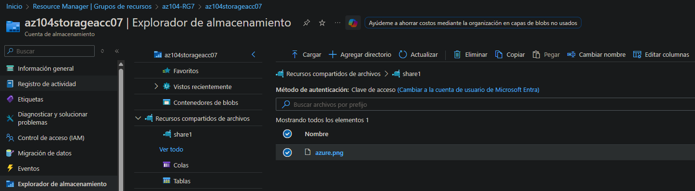

To further secure access, I created a **Virtual Network** named `vnet1`.

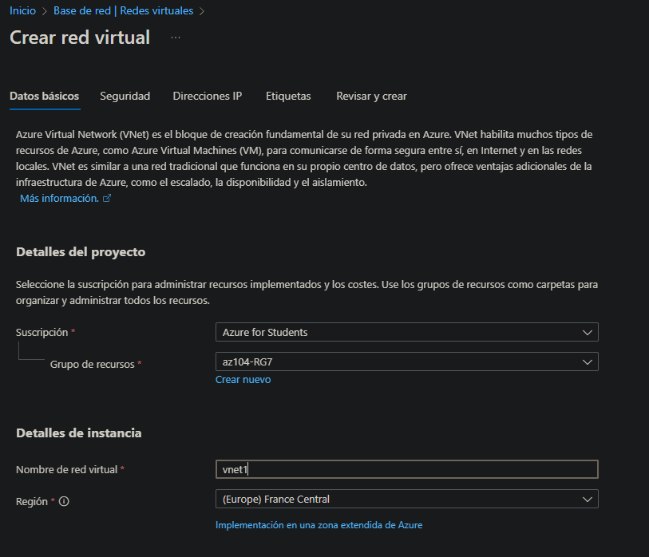

Within the virtual network configuration, I enabled a **Service Endpoint** for **Microsoft.Storage** on the default subnet.

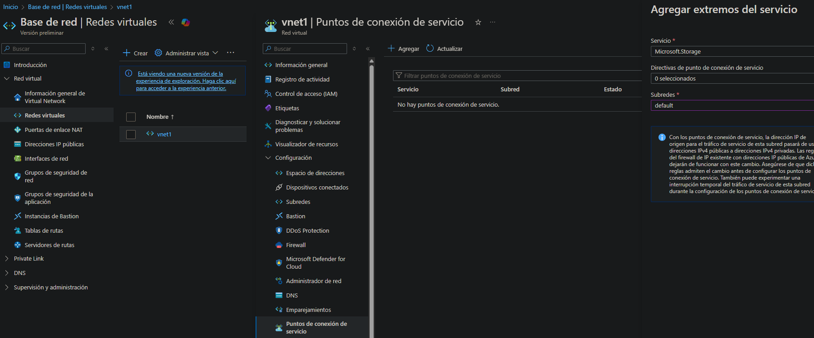

I then returned to the storage account network settings, allowed access from the newly created virtual network, and removed my public IP address.

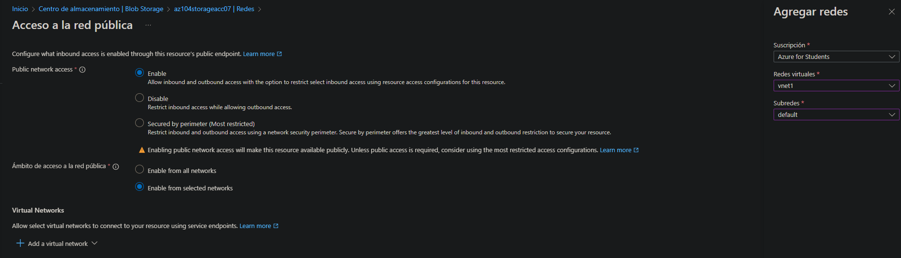

After this change, attempting to access the storage resources resulted in a **network access denied** message, confirming that access was now restricted to the virtual network only.

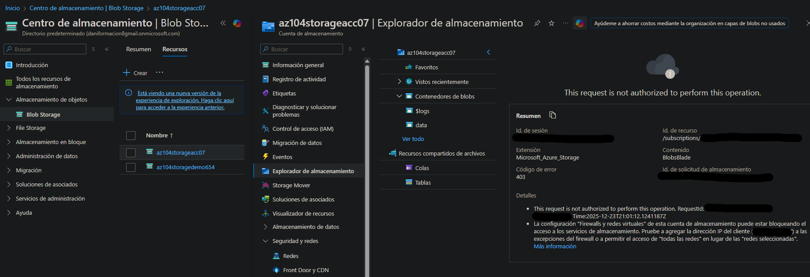

---

## Cleanup

To avoid unnecessary costs and leftover configurations, I removed all resources created during this lab.

The easiest way to clean up is to delete the entire resource group after removing any locks or dependencies.

### Azure Portal
Resource Group → Delete resource group

### Azure PowerShell
```powershell
Remove-AzResourceGroup -Name az104-RG7
