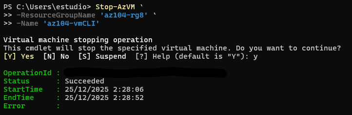
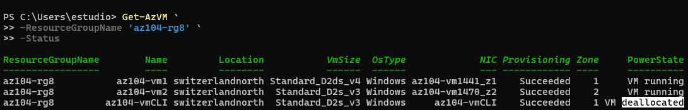
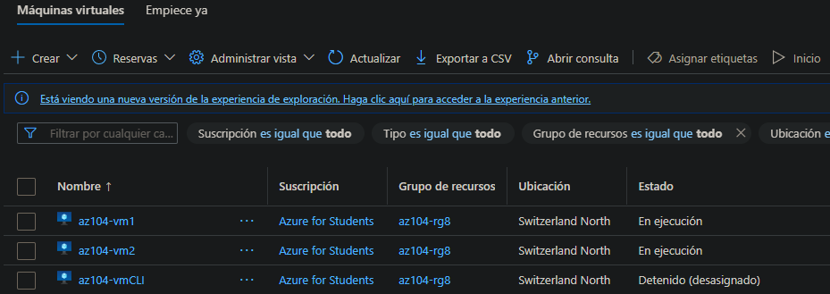
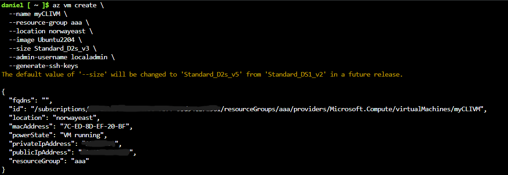
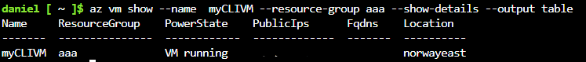
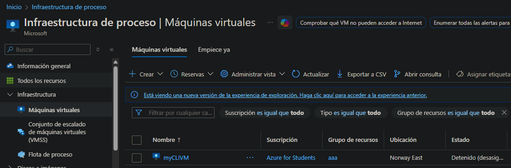

# Lab 08 – Gestionar Máquinas Virtuales (AZ-104)

## Introducción

En este laboratorio, exploramos la implementación y gestión de Máquinas Virtuales de Azure, comparando **máquinas virtuales independientes** con **Conjuntos de Escalado de Máquinas Virtuales (VMSS)**.  
Se cubren conceptos clave como **Zonas de Disponibilidad**, **escalado vertical**, **escalado horizontal automático** y la creación de VMs usando **Portal de Azure, PowerShell y Azure CLI**.

---

## Escenario de negocio

La organización quiere evaluar diferentes enfoques para desplegar y escalar máquinas virtuales en Azure.  
Primero, se despliegan máquinas virtuales individuales a través de **Zonas de Disponibilidad** para mejorar la disponibilidad.  
Posteriormente, se implementa un **Conjunto de Escalado de Máquinas Virtuales** para escalar recursos automáticamente según la demanda de carga de trabajo.

---

## Objetivos del laboratorio

- Desplegar máquinas virtuales en Zonas de Disponibilidad  
- Escalar recursos de cómputo y almacenamiento  
- Crear y configurar un Conjunto de Escalado de VM  
- Configurar reglas de autoescalado  
- Crear máquinas virtuales usando PowerShell y Azure CLI  
- Limpiar los recursos al finalizar el laboratorio  

---

## Tarea 1 – Crear Máquinas Virtuales en Zonas de Disponibilidad

Como siempre, comienzo creando un **Grupo de Recursos** donde se agruparán todos los recursos del laboratorio.


Luego, voy a **Máquinas Virtuales** y hago clic en **Crear**.  
Durante la creación de la VM, selecciono el Grupo de Recursos y configuro **dos máquinas virtuales**, cada una desplegada en una **Zona de Disponibilidad diferente** dentro de la misma región.


Selecciono **Seguridad estándar**, la imagen **Windows Server 2025 Datacenter x64 Gen2**, desactivo **Azure Spot** para evitar interrupciones, y elijo la **SKU D2s_v3 estándar**, suficiente para este laboratorio.  
Configuro nombre de usuario y contraseña y desactivo la hibernación.


En la configuración de discos, desactivo el cifrado de host, selecciono un **SSD estándar de 128 GB**, habilito la eliminación del disco al borrar la VM y dejo la clave de cifrado gestionada por Azure.


En redes, selecciono la VNet y subred, no abro puertos públicos de entrada, configuro que la IP pública se elimine con la NIC y no utilizo balanceador de carga.


Deshabilito los diagnósticos de arranque, ya que no son necesarios en este laboratorio.


Reviso la configuración y creo las máquinas virtuales.


Una vez completado el despliegue, ambas VMs son visibles, cada una desplegada en una Zona de Disponibilidad distinta.


---

## Tarea 2 – Escalar recursos de cómputo y almacenamiento

Selecciono **az104-vm1** y voy a **Disponibilidad + Escala → Tamaño**, donde actualizo la SKU de **D2s_v3** a **D2ds_v4**.


La operación se completa correctamente, confirmado por notificaciones del portal.


Luego agrego un **disco de datos** desde **Configuración → Discos**, creando un disco **HDD de 32 GB**.


El disco se adjunta correctamente a la VM.


Después, desacoplo el disco usando el icono de desconexión para poder modificarlo y reutilizarlo.


Desde la página principal del portal, selecciono el recurso de disco.


Actualizo el tipo de disco de **HDD** a **SSD estándar** y aplico los cambios.


Finalmente, vuelvo a adjuntar el disco existente a la máquina virtual.


---

## Tarea 3 – Crear y configurar un Conjunto de Escalado de Máquinas Virtuales

Busco **Conjuntos de Escalado de Máquinas Virtuales** y hago clic en **Crear**.


Configuro Grupo de Recursos, nombre del conjunto de escalado, región, Zonas de Disponibilidad, modo de orquestación **Uniforme**, seguridad estándar y capacidad manual.


Establezco un recuento base de instancias **2**, selecciono **Windows Server 2025 Datacenter Gen2**, SKU **D2s_v3**, deshabilito hibernación y configuro credenciales.


Creo una nueva VNet llamada **vmss-vnet8** con rango de direcciones **10.81.0.0/20** y subred **10.81.0.0/24**.


Creo un **NSG** con una regla que permite **tráfico HTTP** desde cualquier origen, para pruebas del Load Balancer.


Configuro la NIC, habilito IP pública y asocio la VNet, subred y NSG.


Configuro un **Load Balancer público**, lo creo y lo selecciono para el conjunto de escalado.


Deshabilito diagnósticos de arranque y dejo las demás configuraciones por defecto. Después de revisar, creo el conjunto de escalado.


Una vez desplegado, confirmo que el VMSS se creó correctamente.


---

## Tarea 4 – Configurar autoescalado del VMSS

Dentro del VMSS, en **Disponibilidad + Escala → Escalado**, cambio el modo de escalado a **Automático**.

Configuro una regla para **aumentar instancias** cuando el uso promedio de CPU supere **70% durante 10 minutos**, aumentando instancias en **50%** con un **cooldown de 5 minutos**.


Configuro otra regla para **reducir instancias** cuando CPU baje de **30% durante 10 minutos**, reduciendo instancias en **50%**.


Configuro límites de instancias para evitar escalado descontrolado.


Establezco el número máximo de instancias en **5**, suficiente para el laboratorio.


En nuevas suscripciones de Azure, puede aparecer un error indicando que **Microsoft.Insights** no está registrado.  
Para resolverlo, ejecuto:

```bash
az provider register --namespace Microsoft.Insights
````

Verifico el estado de registro:

```bash
az provider show --namespace Microsoft.Insights --query "registrationState"
```

---

## Tarea 5 – Crear una VM usando PowerShell

Desde Cloud Shell (PowerShell):

```powershell
Get-AzVM
```

Creo una nueva máquina virtual:

```powershell
New-AzVM `
-ResourceGroupName 'az104-rg8' `
-Name 'myPSVM' `
-Location 'East US' `
-Image 'Win2019Datacenter' `
-Zone '1' `
-Size 'Standard_D2s_v3' `
-Credential (Get-Credential)
```



Detengo la VM:

```powershell
Stop-AzVM -ResourceGroupName 'az104-rg8' -Name 'myPSVM'
```

Confirmo que el estado es **Deallocated**.



Los cambios se reflejan también en el **Azure Portal**.



---

## Tarea 6 – Crear una VM usando Azure CLI

Desde Cloud Shell (Bash):

```bash
az vm create \
--name myCLIVM \
--resource-group az104-rg8 \
--image Ubuntu2204 \
--admin-username localadmin \
--generate-ssh-keys
```



Verifico el estado de la VM:

```bash
az vm show --name myCLIVM --resource-group az104-rg8 --show-details --output table
```



Desaloco la VM:

```bash
az vm deallocate --resource-group az104-rg8 --name myCLIVM
```

Los cambios se reflejan correctamente en el portal.



---

## Limpieza de recursos

Para evitar costes innecesarios, elimino el Grupo de Recursos, lo que borra todos los recursos asociados.

Azure Portal:

Grupos de Recursos → Eliminar Grupo de Recursos

Azure PowerShell:

```powershell
Remove-AzResourceGroup -Name az104-rg8
```

