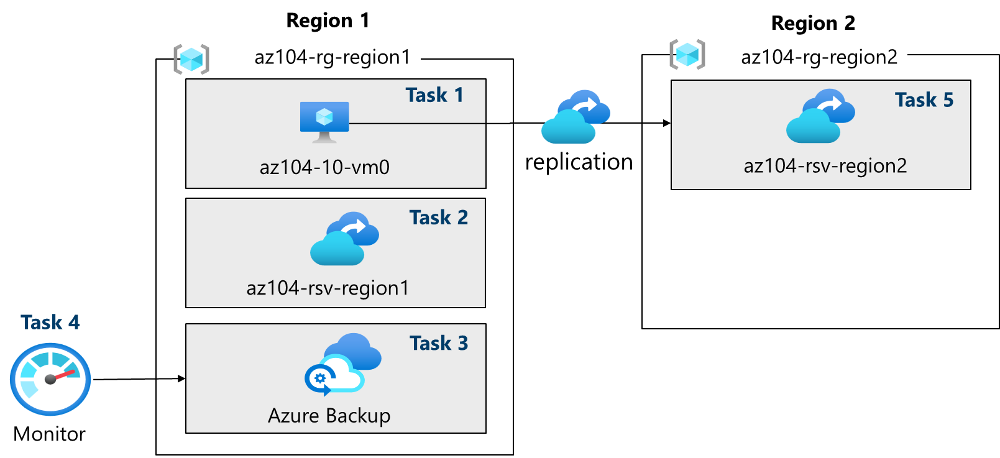

# Lab 10 – Implement Azure Backup and Disaster Recovery (AZ-104)

Notes and documentation for Lab 10 of AZ-104.

## Overview

In this lab, I worked with **Azure Backup** and **Azure Site Recovery** to implement a complete **data protection and disaster recovery solution** in Azure.
The lab covers deploying a **virtual machine** using an **ARM template**, creating and configuring a **Recovery Services Vault**, implementing **VM-level backups**, configuring **backup policies**, enabling **monitoring and diagnostics**, and setting up **cross-region replication** for disaster recovery.

The objective was to explore how to protect critical workloads and prepare an environment for **real-world business continuity and disaster recovery scenarios** in Azure.

## Architecture Diagram

The following diagram shows the architecture deployed in this lab:

## Business Scenario

The organization needs to protect a **critical virtual machine** against:

* Data loss
* Accidental deletions
* Regional failures

A solution was required that allows:

* Performing **automatic backups**
* Retaining data for a defined period
* Replicating infrastructure to a **secondary region** for disaster recovery

This lab reflects a real-world **business continuity scenario**, where protecting and restoring critical workloads is essential to minimize the impact of incidents.

## Architecture Diagram

The following diagram shows the architecture deployed in this lab:

## What I Learned

* How to deploy infrastructure using **ARM templates**
* How to create and configure a **Recovery Services Vault**
* How to configure **Azure Backup** for a virtual machine
* How to create and apply a **backup policy** with retention and scheduling
* How to enable **monitoring and diagnostics** with storage accounts
* How to configure **cross-region replication** using **Azure Site Recovery**
* Best practices for **resource cleanup** after testing

## ARM Templates

The following ARM files were used to deploy and configure the lab environment:

* 📄 [template.json](arm/template.json) – Defines the full infrastructure, including VM, network, NIC, public IP, and NSG
* 📄 [parameters.json](arm/parameters.json) – Parameter file separating configuration values, including VM names, size, network, and admin user

## Full Documentation

For step-by-step instructions with screenshots in **English**, see [Lab10_Full_Documentation.md](Lab10_Full_Documentation.md)       
For the **Spanish version**, see [lab10_Documentacion_completa.md](Lab10_Documentacion_completa.md)
