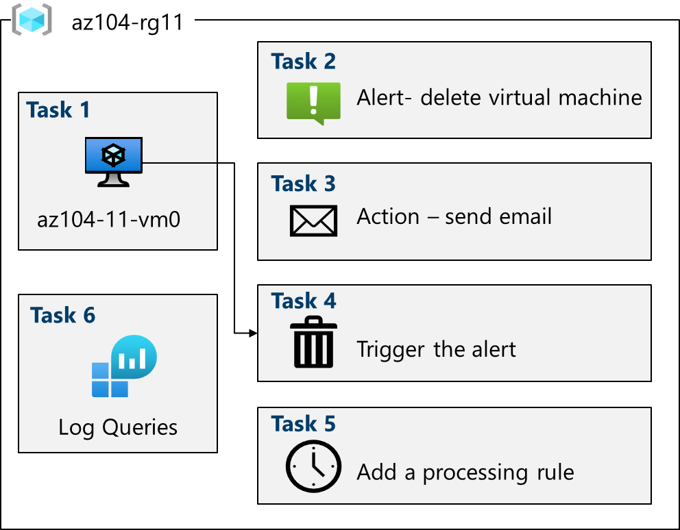

# Lab 11 – Implement Monitoring with Azure Monitor (AZ-104)

Notes and documentation for Lab 11 of AZ-104.

## Overview

In this lab, I explored **Azure Monitor** to implement **proactive monitoring** of Azure resources. The lab includes deploying a **virtual machine** using an **ARM template**, enabling **VM Insights**, creating **alert rules** and **action groups**, testing alerts, configuring **alert processing rules** for maintenance windows, and querying data using **Azure Monitor Logs (KQL)**.

The goal was to understand how to monitor Azure workloads in real time, detect critical events, notify operations teams, and analyze metrics and logs for operational insights.

## Architecture Diagram

The following diagram shows the architecture deployed in this lab:

## Business Scenario

The organization has migrated its infrastructure to Azure and requires a **monitoring solution** to ensure administrators are notified of critical changes, such as **virtual machine deletions**.

A solution was needed that allows:

* Real-time monitoring of virtual machines
* Detection of significant events at the subscription level
* Automatic notifications to the operations team
* Suppression of alerts during planned maintenance periods
* Centralized analysis of metrics and events using log queries

This lab represents a real-world **proactive monitoring scenario**, essential to maintain stability, security, and operational awareness in production environments.

## What I Learned

* How to deploy infrastructure using **ARM templates**
* How to enable **VM Insights** for virtual machines
* How to create **alert rules** for critical events
* How to configure **action groups** with email notifications
* How to test alerts by performing real actions (e.g., deleting a VM)
* How to configure **alert processing rules** to suppress notifications during maintenance
* How to query and analyze metrics and events using **Azure Monitor Logs (KQL)**
* Best practices for **resource cleanup** after testing

## ARM Templates

The following ARM file was used to deploy the lab environment:

* 📄 [template.json](arm/template.json) – Defines the infrastructure including a virtual machine, network, NIC, public IP, and monitoring configuration

A detailed explanation of the ARM template used in this lab is available here:

- 📄 [ARM Template Explained (English)](arm/explanations.md)
- 📄 [ARM Template Explicado (Español)](arm/explicaciones.md)

## Full Documentation

For step-by-step instructions with screenshots in **English**, see [Lab11_Full_Documentation.md](Lab11_Full_Documentation.md)     
For the **Spanish version**, see [Lab11_Documentacion_completa.md](Lab11_Documentacion_completa.md)
